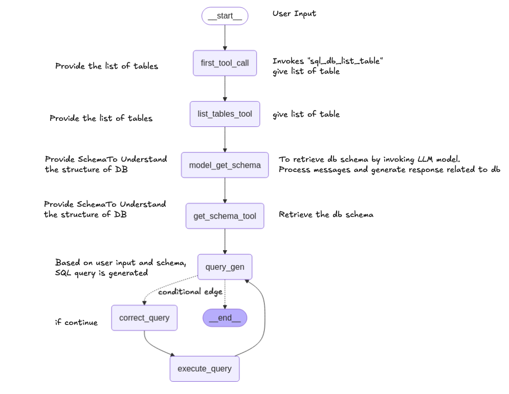

# SQL Agent with LangGraph

The agent allows users to query a database using natural language, with the system handling all the complexities of converting those questions into SQL queries and providing the results.



## Overview

The SQL Agent uses a graph-based workflow to process natural language queries and convert them into SQL. The workflow follows these steps:

1. **List Tables**: Identifies available tables in the database
2. **Get Schema**: Retrieves the database schema to understand table structures
3. **Generate Query**: Creates a SQL query based on the user's natural language question
4. **Validate Query**: Checks the query for errors and fixes them if needed
5. **Execute Query**: Runs the validated SQL query against the database
6. **Format Answer**: Presents the query results in a clear, conversational format

## Key Components for Building an Agentic Flow

### 1. State Management

```python
class State(TypedDict):
    messages: Annotated[list[AnyMessage], add_messages]
```

The `State` class is crucial for maintaining context throughout the agent's workflow. It stores conversation history and enables stateful reasoning across multiple steps.

### 2. Tools and Tool Binding

Tools are functions that allow the agent to perform specific actions:

```python
# Database query tool
@tool
def query_to_database(query: str) -> str:
    """Execute a SQL query against the database and return the result."""
    result = db.run_no_throw(query)
    if not result:
        return "No result returned from the query. Please try again."
    return result

# Binding tools to the language model
llm_with_tools = llm.bind_tools([query_to_database])
```

The SQL Agent uses several tools:

- `sql_db_list_tables`: Lists available tables in the database
- `sql_db_schema`: Retrieves database schema information
- `query_to_database`: Executes SQL queries against the database

### 3. Specialized Response Formatting

```python
class SubmitFinalAnswer(BaseModel):
    """Submit the final answer to the user based on the query results."""
    final_answer: str = Field(..., description="The final answer to the user's question.")

llm_with_final_answer = llm.bind_tools([SubmitFinalAnswer])
```

This structured output ensures consistent formatting of responses to users.

### 4. Node Functions

Each node in the graph represents a specific function:

```python
def first_tool_call(state: State):
    """Initiates the first tool call to list tables"""
    return {"messages": [AIMessage(content="", tool_calls=[{"name":"sql_db_list_tables", "args":{}, "id": "tool_call_id"}])]}

def llm_get_schema(state: State):
    """Gets the database schema using the language model"""
    messages = state["messages"]
    response = llm_to_get_schema.invoke(messages)
    return {"messages": [response]}

def generation_query(state: State):
    """Generates SQL queries based on user input"""
    message = query_generator.invoke(state)
    # Error handling for hallucinated tool calls
    # ...
    return {"messages": [message] + tool_messages}
```

### 5. Error Handling

```python
def handle_tool_error(state: State):
    error = state.get("error")
    tool_calls = state["messages"][-1].tool_calls
    return {
        "messages": [
            ToolMessage(
                content=f"Error: {repr(error)}\n please fix your mistakes.",
                tool_call_id=tc["id"],
            ) for tc in tool_calls
        ]
    }

# Creating nodes with error handling
def create_node_from_tool_with_fallback(tools: list):
    return ToolNode(tools).with_fallbacks(
        [RunnableLambda(handle_tool_error)],
        exception_key="error"
    )
```

This robust error handling allows the agent to gracefully recover from issues and provide helpful feedback.

### 6. Workflow Graph Construction

```python
workflow = StateGraph(State)

# Adding nodes
workflow.add_node("first_tool_call", first_tool_call)
workflow.add_node("list_tables_tool", list_tables)
workflow.add_node("model_get_schema", llm_get_schema)
# ...more nodes

# Adding edges (transitions between nodes)
workflow.add_edge(START, "first_tool_call")
workflow.add_edge("first_tool_call", "list_tables_tool")
workflow.add_edge("list_tables_tool", "model_get_schema")
# ...more edges

# Adding conditional logic for branching
workflow.add_conditional_edges(
    "query_gen",
    should_continue,
    {END: END, "correct_query": "correct_query"}
)
```

The directed graph defines how the agent transitions between different states and actions.

### 7. Conditional Routing

```python
def should_continue(state: State):
    messages = state["messages"]
    last_message = messages[-1]

    if getattr(last_message, "tool_calls", None):
        return END
    elif last_message.content.startswith("Error: "):
        return "query_gen"
    else:
        return "correct_query"
```

This function allows the agent to make decisions about the next steps based on the current state.

## Usage

To use the SQL Agent, you'll need:

1. A database connection (SQLite in this example)
2. A language model (we're using Llama via Groq)
3. The LangChain and LangGraph libraries

Once set up, you can query your database with natural language:

```python
from langchain_core.messages import HumanMessage

query = {
    "messages": [
        HumanMessage(content="how many orders are there which is more than 300 rupees?")
    ]
}

# Get the full response with all intermediate steps
response = app.invoke(query)

# Get just the final answer
final_answer = response["messages"][-1].tool_calls[0]["args"]["final_answer"]

# To see the step-by-step processing, use stream()
for chunk in app.stream(query):
    print(chunk)
```